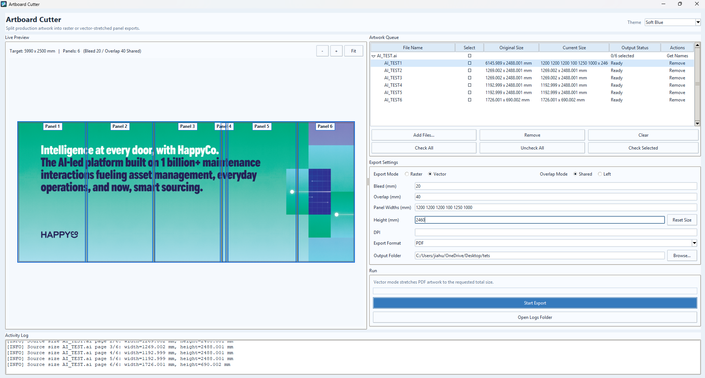
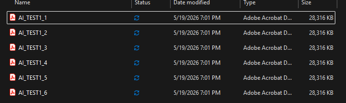

# Artboard Cutter

Artboard Cutter is a Windows desktop prepress tool for splitting large PDF, AI-compatible PDF, and image artwork into production panels.

It supports custom panel widths, outside-only bleed, shared or left-only overlap, raster export, and vector-preserving PDF export.



## Output Example

Vector export stretches the full artwork to the requested target size first, then clips each panel from that stretched master. This keeps raster and vector panel geometry aligned.




## Current Features

- Multi-page/artboard import with one queue profile per page.
- Grouped queue rows for multi-page files.
- Editable queue output names.
- Per-artwork session settings in the queue.
- Reset Size from original artwork dimensions.
- Raster export to PDF, JPG, and TIFF.
- Vector PDF export with stretch-to-fit behavior.
- Shared overlap mode and left-only overlap mode.
- Live preview with panel labels, bleed, overlap zones, export edges, zoom, fit, and pan.
- Persistent app settings for output folder, bleed, overlap, overlap mode, DPI, export format, export mode, theme, and window geometry.
- Optional Illustrator artboard-name lookup on Windows when Adobe Illustrator and `pywin32` are available.
- Structured JSON runtime logs under `logs/`.
- Built-in Open Logs Folder action.
- Multiple professional themes.

## Project Layout

```text
artboard_cutter_gui_advanced.py   Main desktop app entry point
src/artboard_cutter_core/         Export engine, layout, settings, themes, profiles
tests/                            Unit and guarded GUI tests
docs/                             Testing notes and README screenshots
ai_logs/                          AI development journal
assets/                           Application icon assets
tools/                            Utility scripts
```

## Install For Development

```powershell
python -m pip install -r requirements.txt
```

Run the app from source:

```powershell
python artboard_cutter_gui_advanced.py
```

Run tests:

```powershell
python -m unittest discover -s tests
```

GUI smoke/screenshot tests are guarded and skip with a clear Tcl/Tk reason when the local Python/Tk runtime cannot create a root window.

## Build Windows Executable

```powershell
build_exe.bat
```

The build embeds `assets/artboard_cutter.ico` into the executable. Windows shortcuts that target `ArtboardCutter.exe` inherit the icon automatically. A shortcut can also explicitly use:

```text
IconLocation = ArtboardCutter.exe,0
```

Current build output:

```text
dist/ArtboardCutter.exe
```

## Notes

- Source artwork, generated exports, generated logs, test outputs, and local build artifacts are intentionally ignored by Git.
- Real `.ai` artboard names require Windows, Adobe Illustrator, and `pywin32`; otherwise the app uses numbered queue names.
- Illustrator can become blocked by its own missing-link dialogs or loading state. Artboard Cutter keeps Illustrator lookup optional and falls back safely.
