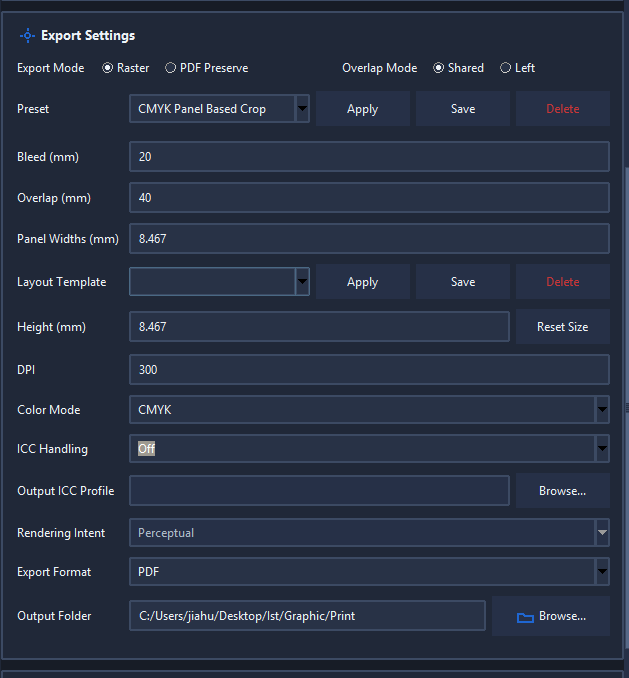

# Artboard Cutter

Artboard Cutter is a Windows desktop prepress tool for resizing artwork and splitting it into production-ready panels. It accepts PDF, AI-compatible PDF, JPG, PNG, TIFF, and multi-page artwork, then exports numbered PDF, JPG, or TIFF panels.

## Contents

- [Quick start](#quick-start)
- [Workspace overview](#workspace-overview)
- [Artwork queue](#artwork-queue)
- [Panel dimensions and layout](#panel-dimensions-and-layout)
- [Presets and layout templates](#presets-and-layout-templates)
- [Raster and PDF Preserve modes](#raster-and-pdf-preserve-modes)
- [Color and ICC profiles](#color-and-icc-profiles)
- [Exporting](#exporting)
- [Jobs, retry, and recovery](#jobs-retry-and-recovery)
- [Troubleshooting](#troubleshooting)
- [Development and release builds](#development-and-release-builds)

## Quick Start

1. Launch `ArtboardCutter.exe`.
2. Click **Add Files...**, or drag supported artwork into any part of the Artwork Queue.
3. Select an artwork row and enter its finished **Panel Widths** and **Height** in millimetres.
4. Set **Bleed**, **Overlap**, and the overlap mode.
5. Choose **Raster** or **PDF Preserve**.
6. For Raster mode, choose the DPI, RGB/CMYK color mode, ICC behavior, and PDF/JPG/TIFF format.
7. Choose an output folder.
8. Tick the queue items you want to export.
9. Click **Start Export**, review the preflight summary, and confirm.

The program creates numbered files such as `Lobby_Wall_1.tif`, `Lobby_Wall_2.tif`, and `Lobby_Wall_3.tif`.

## Workspace Overview

The left side contains the live artwork preview. The right side contains the queue, export settings, run controls, and activity log. Themes and window proportions can change the appearance, but the workflow stays the same.


The preview shows:

- The resized full artwork.
- Every numbered export panel.
- Outside bleed and internal overlap areas.
- Panel seams that can be dragged horizontally.
- The total target dimensions and X/Y scale percentages.

Preview controls:

- **Fit** returns the whole artwork to the visible workspace.
- **+ / -** or the mouse wheel zooms.
- Middle-mouse drag pans.
- Dragging an internal seam changes its two neighboring widths while preserving the total width.
- **Add Panel** increases the panel count and evenly redistributes the complete artwork width.
- The **Panels** number and **Set** button directly change the count and evenly divide the complete width.

## Artwork Queue

### Add artwork

Use **Add Files...** or drag files into the Artwork Queue. File drops work over the queue rows and the empty-queue message.

Supported input extensions:

- `.pdf`
- `.ai` when it contains PDF-compatible artwork
- `.jpg` / `.jpeg`
- `.png`
- `.tif` / `.tiff`

Multi-page PDF or AI-compatible files appear as a group with one editable queue profile per page/artboard. Each profile can have different dimensions and export settings.

### Select what will be exported

Selecting a row for editing is different from ticking it for export.

- Click a queue row to load its settings and preview.
- Tick its checkbox to include it in the next export.
- **Check All**, **Uncheck All**, and **Check Selected** manage multiple rows.
- **Remove** deletes selected queue rows; **Clear** empties the queue.

Double-click a queue artwork name to edit the output base name. Invalid Windows filename characters are automatically rejected or cleaned when names come from Illustrator.

For multi-artboard `.ai` files, **Get Names** attempts to read real artboard names from a running Adobe Illustrator installation. If Illustrator is unavailable or busy, numbered names are used safely.

## Panel Dimensions and Layout

All production dimensions are entered in millimetres.

### Panel Widths

Enter one content width per panel, separated by spaces or commas:

```text
1200 1200 1200 100 1250 1000
```

The number of values is the number of output panels. Their sum is the full artwork content width before outside bleed.

### Height

**Height** is the finished content height. Top and bottom bleed are added during export. **Reset Size** restores both the panel width and height to the original artwork dimensions.

### Bleed

Bleed is applied only around the outside of the complete assembled artwork:

- Left edge of the first panel.
- Right edge of the last panel.
- Top and bottom of every panel.

It is not repeatedly inserted between internal panels.

### Overlap

Overlap adds shared artwork at internal seams:

- **Shared** divides the overlap equally between the two neighboring panels. A 40 mm overlap places 20 mm on each side of the seam.
- **Left** places the complete overlap on the left edge of the right-hand panel. The preceding panel ends at its content edge.

Overlap must be smaller than the narrowest panel.

### Even panel distribution

**Add Panel** and the direct **Panels / Set** control always use the full current artwork width. For example:

```text
Current widths: 600 400        Total: 1000 mm
Set panels to: 4
New widths:     250 250 250 250
```

This does not repeatedly split only the last panel.

## Presets and Layout Templates



### Export Preset

A preset stores reusable production/export behavior:

- Bleed and overlap.
- Shared or Left overlap mode.
- DPI.
- RGB or CMYK.
- Raster/PDF Preserve mode.
- PDF, JPG, or TIFF format.
- ICC handling, output profile path, and rendering intent.

A preset deliberately does **not** change:

- Panel widths.
- Artwork height.
- Output folder.
- Queue output name.

Use **Save** to name the current export settings, **Apply** to load a selected preset, and **Delete** to remove one.

### Layout Template

A layout template stores only the number and relative proportions of the panels. It never changes the overall artwork width or height.

For example, saving widths `250 500 250` creates a `25% / 50% / 25%` template. Applying that template to artwork with a 2000 mm total width produces `500 1000 500`.

Use layout templates for recurring arrangements such as equal panels, a wide center panel, or narrow end returns. Use export presets separately for print-production settings.

## Raster and PDF Preserve Modes

### Raster

Raster mode renders the resized artwork to pixels and supports:

- Raster PDF.
- JPG.
- TIFF and BigTIFF.
- Explicit DPI.
- RGB or CMYK output.
- ICC conversion or profile embedding.

The full artwork is resized first and then cropped into panels. If the entered target proportions differ from the source, the program warns that X and Y will be stretched by different amounts.

Large JPG and raster-PDF panels may use a lower common effective DPI to stay within safe memory limits. TIFF uses streamed 256-row bands and retains the requested DPI, including very large BigTIFF output.

### PDF Preserve

PDF Preserve always outputs PDF. It resizes the complete source artwork and clips the panels from that resized master.

- Vector PDF/AI-compatible content remains vector when possible.
- Raster source images remain raster images embedded in PDF; they are not traced into vectors.
- DPI, raster format, RGB/CMYK, and ICC raster controls are disabled because they do not apply to this path.

Use PDF Preserve when maintaining vector text, shapes, and line art is more important than generating fixed raster pixels.

## Color and ICC Profiles

These controls apply to Raster mode.

### Color Mode

- **RGB** creates three-channel RGB raster output.
- **CMYK** creates four-channel CMYK raster output.

### ICC Handling

- **Off** performs no ICC conversion and embeds no selected output profile.
- **Embed only** assigns and embeds the selected output profile without changing pixel values.
- **Convert** transforms the raster pixels into the selected output profile and embeds it.

When **Convert** is selected, the program uses an embedded RGB profile from supported raster input when available. Otherwise it assumes an sRGB working space. PDF and AI source profiles are not always directly discoverable, so confirm the intended source space for color-critical legacy files.

The selected ICC profile must match **Color Mode**: choose an RGB output profile for RGB and a CMYK output profile for CMYK. JPG and TIFF contain the embedded profile; raster PDF receives an output intent.

### Rendering Intent

Rendering intent is used only during ICC conversion:

- **Perceptual** is a common choice for photographic or wide-gamut artwork.
- **Relative Colorimetric** preserves in-gamut colors and maps the source white to the destination white.
- **Saturation** favors vividness over precise color relationships.
- **Absolute Colorimetric** preserves the source white-point relationship and is generally used for proofing workflows.

When unsure, use the profile and rendering intent required by the printer or RIP operator.

## Exporting

### Preflight

After **Start Export**, preflight reports or checks:

- Jobs and total panel count.
- Planned output filenames and duplicate-name conflicts.
- Output-folder write access.
- Existing or stale numbered panel files.
- Requested and effective DPI.
- Largest panel megapixels.
- Estimated raw image data and output disk space.
- TIFF/BigTIFF streaming status.
- Available disk space and large-job warnings.

Review the information before continuing. If existing panels will be replaced, the program asks for confirmation.

### Safe output and verification

Every panel set is written to staged temporary files first. Before final files are committed, the program verifies applicable properties including:

- Actual file format.
- Pixel or PDF page dimensions.
- DPI metadata.
- RGB/CMYK mode.
- Embedded ICC profile when requested.
- Silent blank or uniform render failures.

If a panel fails, the incomplete staged set is discarded instead of replacing a previously successful panel set.

### Output filenames

Each panel uses the queue output name followed by its one-based panel number:


The separate panels are designed to align when assembled with the configured overlap:


### Cancel and activity log

**Cancel Export** stops safely after the current bounded operation. Successfully committed earlier jobs remain available, while the incomplete active panel set is discarded.

The Activity Log shows preflight information, effective DPI, crop positions, TIFF writer details, ICC actions, verification results, warnings, and errors. **Open Logs Folder** opens the persistent structured logs under:

```text
%LOCALAPPDATA%\ArtboardCutter\logs
```

## Jobs, Retry, and Recovery

### Save and load a complete job

**Save Job...** writes the complete queue and its per-artwork settings to an `.artboard-job.json` file. **Load Job...** restores that queue later.

Use a job file when you need the exact artwork paths, names, dimensions, selected pages, panel widths, and export settings. Use a preset when you only need reusable production behavior.

### Retry Failed / Resume

If one or more jobs fail or are cancelled, click **Retry Failed / Resume**. The program selects only failed or interrupted queue items and restarts them. Completed jobs are not selected again.

Each individual panel set is transactional, so an interrupted job resumes by safely regenerating that job rather than trusting a partial output set.

### Session recovery

The queue is periodically saved during the active session. After an abnormal shutdown, the next launch offers to restore it. A normal application close removes the temporary recovery session.

## Troubleshooting

### A TIFF panel is empty

Current TIFF output is streamed and automatically checked for blank/uniform failures. If verification stops the export:

1. Read the Activity Log and open the persistent logs.
2. Confirm the source crop actually contains artwork.
3. Check available disk space.
4. Try PDF Preserve if the source is vector PDF/AI artwork.

Do not use an older executable that predates the streamed TIFF and verification changes.

### JPG or TIFF appears to be a PDF

Confirm **Export Mode** is Raster and **Export Format** is JPG or TIFF. PDF Preserve intentionally forces PDF output.

### Files will not drop into the queue

Drop supported files anywhere inside the Artwork Queue, including over the empty message. If Windows blocks drag-and-drop between applications running at different privilege levels, launch both applications normally rather than running only one as Administrator.

### A preset does not change panel dimensions

This is intentional. Export presets do not contain dimensions. Use **Layout Template**, the direct panel count, **Add Panel**, or edit **Panel Widths** manually.

### ICC profile is rejected

Verify that:

- The file exists and is a valid `.icc` or `.icm` profile.
- Its color space matches RGB/CMYK.
- ICC Handling is set to Off if no profile should be used.

### Export uses a lower DPI

Very large JPG and raster-PDF jobs can exceed the safe full-frame render limit. Preflight reports the common reduced DPI before export. TIFF uses bounded streaming and normally retains the requested DPI.

### Existing output files block export

Approve the replacement prompt if the files belong to the same job. Replacement and stale extra-panel removal happen only after the new complete set succeeds.

### Illustrator artboard names are unavailable

Real `.ai` artboard-name lookup requires Windows, Adobe Illustrator, and `pywin32`. Illustrator can also be blocked by a missing-link dialog. Close Illustrator dialogs or keep the automatically generated names.

## Current Features

- Multi-page/artboard queue with independent per-page settings.
- Editable output names and Illustrator name lookup.
- Outside-only bleed and Shared/Left internal overlap.
- Custom, evenly distributed, and proportion-template panel layouts.
- Raster PDF, JPG, streamed TIFF/BigTIFF, and PDF Preserve.
- RGB/CMYK and ICC-managed raster output.
- Large-job preflight, transactional output, and automatic verification.
- Cancellation, retry/resume, saved job files, and crash recovery.
- Persistent presets, output history, themes, window settings, and structured logs.

## Development and Release Builds

### Project layout

```text
artboard_cutter_gui_advanced.py   Main desktop app entry point
src/artboard_cutter_core/         Export engine, layout, settings, profiles
tests/                            Automated unit, export, and GUI tests
docs/                             Testing notes and guide screenshots
ai_logs/                          AI-assisted development journal
assets/                           Application icon and local UI icons
installer/                        Inno Setup installer definition
tools/                            Build and release utilities
```

### Development setup

```powershell
python -m venv .venv
.\.venv\Scripts\python.exe -m pip install -r requirements.txt -r requirements-dev.txt
.\.venv\Scripts\python.exe artboard_cutter_gui_advanced.py
```

Run tests:

```powershell
.\.venv\Scripts\python.exe -m unittest discover -s tests
```

### Build the Windows executable

```powershell
.\build_exe.bat
```

Output:

```text
dist\ArtboardCutter.exe
```

The build embeds the application icon, local UI icons, Tcl/Tk, TIFF streaming dependencies, and Windows version metadata.

### Build and sign an installer

With Inno Setup 6 installed:

```powershell
.\tools\build_release.ps1
```

For Authenticode signing, set the application-specific certificate variable first:

```powershell
$env:ARTBOARD_CUTTER_CERT_THUMBPRINT = "YOUR_CERTIFICATE_THUMBPRINT"
.\tools\build_release.ps1
```

`update-manifest.example.json` documents the HTTPS release metadata format. Configure `UPDATE_MANIFEST_URL` in `src/artboard_cutter_core/version.py` when a hosted update channel is available.
